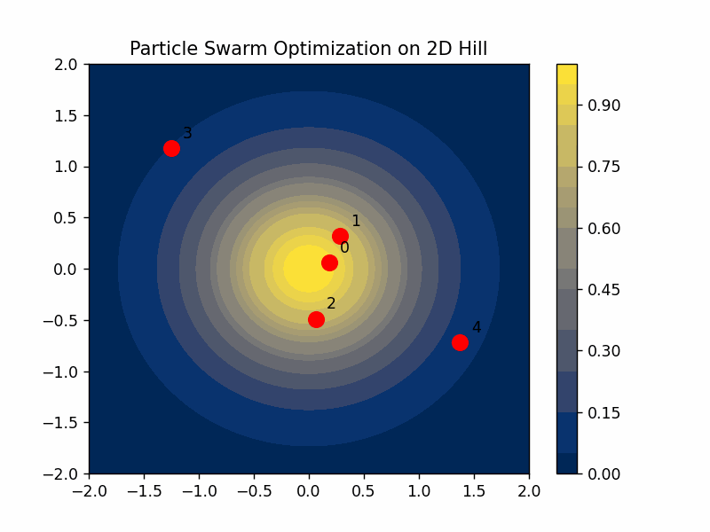

# Particle Swarm Optimization (PSO) in 2D

## Problem Statement
In this visualization, we simulate the behavior of birds attempting to find the highest point on a hill. This is a metaphorical representation of how the PSO algorithm searches for an optimal solution in a 2D space.

- **Initialization**: Scatter 5 birds (particles) randomly across a map, with some on the hill and some farther away.
  
- **Communication**: The bird highest up the hill communicates its position, essentially stating, "This is a high spot!".
  
- **Update Positions**: Based on their current positions, their personal best positions, and the group's best-known position, each bird decides where to move next.
  
- **Iteration**: Birds continue moving, updating their personal bests and the group's best, thereby getting closer to the hill's peak.
  
- **Stopping Criterion**: After numerous iterations, once all birds are close to the peak, we can conclude they've found the highest point.

## Solution Visualization

The solution is visualized in the following way:

The contour plot represents a 2D hill (Gaussian distribution). The red dots are the birds (particles), each labeled with a unique number for easier tracking. As the animation progresses, observe how the particles converge towards the peak of the hill, representing the optimal solution.

## How to Run
1. Ensure you have the required Python libraries installed (`numpy` and `matplotlib`).
2. Run the `PSO.py` script.
3. View the resulting animation, and find the saved `.gif` in the project directory.

---

Developed as an illustrative example of the PSO algorithm. For further details or inquiries, please reach out.
